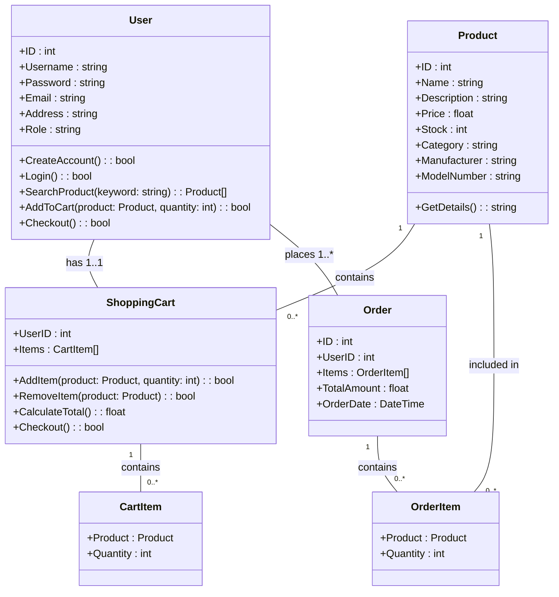

### 1. github 공개 레포지토리를 만들고 URL을 공개하십시오.
https://github.com/angelgold1004/AhnLabSEM_GPT/new/main
   
### 2. 개발자용 프롬프트 3가지 이상을 작성하시오 ( 그 중 한가지는 UML 과제 )

1) 모의 데이터 생성</p>
   아두이노 부품 사이트에 대한 10개 제품을 JSON으로 샘플 데이터를 만들어줘.<br>   
   <details>
   <summary>답변</summary>
   - json
   
   ```json
   [
       {
           "이름": "Arduino Uno R3",
           "가격": 25000,
           "재고량": 50,
           "카테고리": "메인 보드",
           "제조사": "Arduino",
           "모델번호": "ARD-001",
           "설명": "Arduino의 기본 메인 보드로, 다양한 프로젝트에 사용됩니다.",
           "링크": "https://www.arduino.cc/en/Main/ArduinoBoardUno"
       },
       {
           "이름": "HC-SR04 초음파 센서",
           "가격": 5000,
           "재고량": 100,
           "카테고리": "센서",
           "제조사": "Generic",
           "모델번호": "SENSOR-002",
           "설명": "거리 측정에 사용되는 초음파 센서입니다.",
           "링크": "https://www.mouser.com/datasheet/2/813/HCSR04-1022824.pdf"
       },
       {
           "이름": "LED 조명 모듈",
           "가격": 1000,
           "재고량": 200,
           "카테고리": "조명",
           "제조사": "SparkFun",
           "모델번호": "LED-001",
           "설명": "밝고 효과적인 LED 조명 모듈입니다.",
           "링크": "https://www.sparkfun.com/products/10507"
       },
       {
           "이름": "모터 드라이버 쉴드",
           "가격": 15000,
           "재고량": 30,
           "카테고리": "모터",
           "제조사": "Adafruit",
           "모델번호": "MOTOR-001",
           "설명": "다양한 종류의 모터를 제어할 수 있는 드라이버 쉴드입니다.",
           "링크": "https://www.adafruit.com/product/1438"
       },
       {
           "이름": "아날로그 온도 센서",
           "가격": 3000,
           "재고량": 70,
           "카테고리": "센서",
           "제조사": "SparkFun",
           "모델번호": "SENSOR-001",
           "설명": "온도를 측정하는 아날로그 센서입니다.",
           "링크": "https://www.sparkfun.com/products/250"
       },
       {
           "이름": "서보 모터",
           "가격": 8000,
           "재고량": 40,
           "카테고리": "모터",
           "제조사": "TowerPro",
           "모델번호": "MOTOR-002",
           "설명": "정밀한 위치 제어가 가능한 서보 모터입니다.",
           "링크": "https://www.towerpro.com.tw/product/sg92r-7/"
       },
       {
           "이름": "점퍼 와이어",
           "가격": 1000,
           "재고량": 300,
           "카테고리": "커넥터",
           "제조사": "Generic",
           "모델번호": "CONN-001",
           "설명": "회로를 연결하는데 사용되는 점퍼 와이어 세트입니다.",
           "링크": "https://www.sparkfun.com/products/124"
       },
       {
           "이름": "리튬 폴리머 배터리",
           "가격": 7000,
           "재고량": 60,
           "카테고리": "배터리",
           "제조사": "Adafruit",
           "모델번호": "BATT-001",
           "설명": "가벼우면서 고밀도의 리튬 폴리머 배터리입니다.",
           "링크": "https://www.adafruit.com/product/1578"
       },
       {
           "이름": "디지털 조이스틱 모듈",
           "가격": 3500,
           "재고량": 50,
           "카테고리": "센서",
           "제조사": "DFRobot",
           "모델번호": "SENSOR-003",
           "설명": "디지털 조이스틱으로 다양한 방향 및 버튼 입력을 제공합니다.",
           "링크": "https://www.dfrobot.com/product-1066.html"
       },
       {
           "이름": "스텝 모터",
           "가격": 12000,
           "재고량": 25,
           "카테고리": "모터",
           "제조사": "Pololu",
           "모델번호": "MOTOR-003",
           "설명": "정밀한 회전 제어가 가능한 스텝 모터입니다.",
           "링크": "https://www.pololu.com/product/2267"
       }
   ]
   ```
</details>

2) 시스템 설계 및 아키텍쳐</p>
   너는 시스템 설계 및 아키텍처 전문가야.<br>
   아두이노 부품 판매 쇼핑몰 시스템을 설계하는 방법을 알려줘. 기술 스택은 백엔드는 자바 스프링부트로 프론트엔드는 react+ Next.js 로 설정해줘<br>
   <details>
   <summary>답변</summary>
   물론입니다! 아두이노 부품 판매 쇼핑몰 시스템을 설계하는 방법은 다음과 같습니다. 이 설계는 백엔드로 자바의 스프링 부트 프레임워크를 사용하고, 프론트엔드로는 React와 Next.js를 사용합니다.

   ## 시스템 아키텍처 설계:
   
   ### 1. 백엔드 (Spring Boot):
   
   #### a. 데이터베이스 구성:
   
   - MySQL, PostgreSQL 또는 MongoDB 등의 데이터베이스를 선택합니다.
   - 제품, 주문, 사용자 정보 등을 저장할 테이블을 설계합니다.
   
   #### b. API 설계:
   
   - Spring Boot에서 RESTful API를 구현합니다.
   - 제품 목록 조회, 제품 상세 정보 조회, 주문 생성 등의 API를 설계합니다.
   
   #### c. 보안:
   
   - JWT(JSON Web Tokens)를 사용하여 사용자 인증 및 권한 부여를 구현합니다.
   - HTTPS를 이용하여 데이터의 안전성을 보장합니다.
   
   #### d. 데이터 검증:
   
   - 입력 데이터의 유효성 검사를 위해 Spring의 Validation 기능을 사용합니다.
   
   #### e. 비즈니스 로직:
   
   - 주문 처리, 장바구니 기능 등과 같은 비즈니스 로직을 구현합니다.
   
   #### f. 테스트:
   
   - JUnit 또는 TestNG를 사용하여 유닛 테스트와 통합 테스트를 작성합니다.
   
   ### 2. 프론트엔드 (React + Next.js):
   
   #### a. 페이지 구성:
   
   - Next.js를 사용하여 페이지를 구성하고 라우팅을 설정합니다.
   
   #### b. 상태 관리:
   
   - React Context API 또는 Redux를 사용하여 상태를 관리합니다.
   
   #### c. 컴포넌트 설계:
   
   - 재사용 가능한 UI 컴포넌트를 설계하고 구현합니다.
   
   #### d. API 통신:
   
   - Axios 또는 fetch API를 사용하여 서버와 통신합니다.
   
   #### e. 사용자 인증:
   
   - 사용자 로그인, 회원가입 및 로그아웃을 구현합니다.
   
   #### f. 스타일링:
   
   - CSS-in-JS 라이브러리 (예: styled-components)를 사용하여 스타일을 적용합니다.
   
   #### g. 테스트:
   
   - Jest 또는 React Testing Library를 사용하여 유닛 테스트와 통합 테스트를 작성합니다.
   
   ### 3. 배포:
   
   - 백엔드는 AWS, Google Cloud 또는 Heroku와 같은 클라우드 플랫폼에 배포합니다.
   - 프론트엔드는 Vercel 또는 Netlify와 같은 정적 호스팅 플랫폼에 배포합니다.
   
   ### 4. 모니터링과 유지보수:
   
   - 로그 모니터링, 성능 최적화 및 정기적인 업데이트를 수행합니다.
   
   ### 5. 보안:
   
   - 웹 애플리케이션 보안을 강화하기 위해 OWASP 보안 가이드를 준수합니다.
   
   이러한 아키텍처를 통해 안정적이고 확장 가능한 아두이노 부품 판매 쇼핑몰을 구축할 수 있습니다. 필요에 따라 추가적인 기능을 구현하고 확장할 수 있습니다.

   </details>

3) UML</p>
   mermaid UML 다이어그램을 작성해줘<br>   
   <details>
   <summary>답변</summary>
   
     ```mermaid
        classDiagram
           class User {
             +ID : int
             +Username : string
             +Password : string
             +Email : string
             +Address : string
             +Role : string
             +CreateAccount() : bool
             +Login() : bool
             +SearchProduct(keyword: string) : Product[]
             +AddToCart(product: Product, quantity: int) : bool
             +Checkout() : bool
           }
         
           class Product {
             +ID : int
             +Name : string
             +Description : string
             +Price : float
             +Stock : int
             +Category : string
             +Manufacturer : string
             +ModelNumber : string
             +GetDetails() : string
           }
         
           class ShoppingCart {
             +UserID : int
             +Items : CartItem[]
             +AddItem(product: Product, quantity: int) : bool
             +RemoveItem(product: Product) : bool
             +CalculateTotal() : float
             +Checkout() : bool
           }
         
           class CartItem {
             +Product : Product
             +Quantity : int
           }
         
           class Order {
             +ID : int
             +UserID : int
             +Items : OrderItem[]
             +TotalAmount : float
             +OrderDate : DateTime
           }
         
           class OrderItem {
             +Product : Product
             +Quantity : int
           }
         
           User -- ShoppingCart : has 1..1
           User -- Order : places 1..*
           Product "1" -- "0..*" ShoppingCart : contains
           Product "1" -- "0..*" OrderItem : included in
           ShoppingCart "1" -- "0..*" CartItem : contains
           Order "1" -- "0..*" OrderItem : contains
      ```
   




   
4. 
