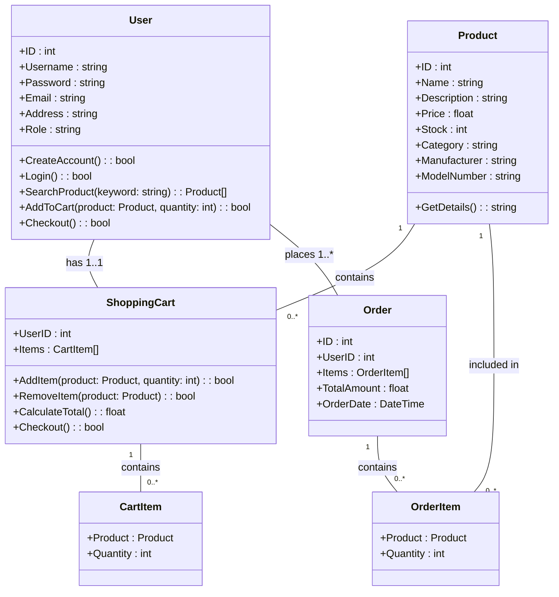
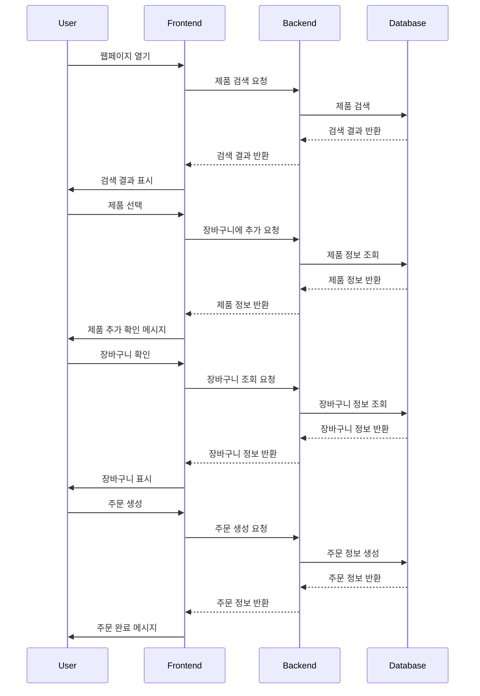

### 1. github 공개 레포지토리를 만들고 URL을 공개하십시오.
https://github.com/angelgold1004/AhnLabSEM_GPT/new/main
   
### 2. 개발자용 프롬프트 3가지 이상을 작성하시오 ( 그 중 한가지는 UML 과제 )

1) 모의 데이터 생성</p>
   아두이노 부품 사이트에 대한 10개 제품을 JSON으로 샘플 데이터를 만들어줘.<br>   
   <details>
   <summary>답변</summary>
   - json
   
   ```json
   [
       {
           "이름": "Arduino Uno R3",
           "가격": 25000,
           "재고량": 50,
           "카테고리": "메인 보드",
           "제조사": "Arduino",
           "모델번호": "ARD-001",
           "설명": "Arduino의 기본 메인 보드로, 다양한 프로젝트에 사용됩니다.",
           "링크": "https://www.arduino.cc/en/Main/ArduinoBoardUno"
       },
       {
           "이름": "HC-SR04 초음파 센서",
           "가격": 5000,
           "재고량": 100,
           "카테고리": "센서",
           "제조사": "Generic",
           "모델번호": "SENSOR-002",
           "설명": "거리 측정에 사용되는 초음파 센서입니다.",
           "링크": "https://www.mouser.com/datasheet/2/813/HCSR04-1022824.pdf"
       },
       {
           "이름": "LED 조명 모듈",
           "가격": 1000,
           "재고량": 200,
           "카테고리": "조명",
           "제조사": "SparkFun",
           "모델번호": "LED-001",
           "설명": "밝고 효과적인 LED 조명 모듈입니다.",
           "링크": "https://www.sparkfun.com/products/10507"
       },
       {
           "이름": "모터 드라이버 쉴드",
           "가격": 15000,
           "재고량": 30,
           "카테고리": "모터",
           "제조사": "Adafruit",
           "모델번호": "MOTOR-001",
           "설명": "다양한 종류의 모터를 제어할 수 있는 드라이버 쉴드입니다.",
           "링크": "https://www.adafruit.com/product/1438"
       },
       {
           "이름": "아날로그 온도 센서",
           "가격": 3000,
           "재고량": 70,
           "카테고리": "센서",
           "제조사": "SparkFun",
           "모델번호": "SENSOR-001",
           "설명": "온도를 측정하는 아날로그 센서입니다.",
           "링크": "https://www.sparkfun.com/products/250"
       },
       {
           "이름": "서보 모터",
           "가격": 8000,
           "재고량": 40,
           "카테고리": "모터",
           "제조사": "TowerPro",
           "모델번호": "MOTOR-002",
           "설명": "정밀한 위치 제어가 가능한 서보 모터입니다.",
           "링크": "https://www.towerpro.com.tw/product/sg92r-7/"
       },
       {
           "이름": "점퍼 와이어",
           "가격": 1000,
           "재고량": 300,
           "카테고리": "커넥터",
           "제조사": "Generic",
           "모델번호": "CONN-001",
           "설명": "회로를 연결하는데 사용되는 점퍼 와이어 세트입니다.",
           "링크": "https://www.sparkfun.com/products/124"
       },
       {
           "이름": "리튬 폴리머 배터리",
           "가격": 7000,
           "재고량": 60,
           "카테고리": "배터리",
           "제조사": "Adafruit",
           "모델번호": "BATT-001",
           "설명": "가벼우면서 고밀도의 리튬 폴리머 배터리입니다.",
           "링크": "https://www.adafruit.com/product/1578"
       },
       {
           "이름": "디지털 조이스틱 모듈",
           "가격": 3500,
           "재고량": 50,
           "카테고리": "센서",
           "제조사": "DFRobot",
           "모델번호": "SENSOR-003",
           "설명": "디지털 조이스틱으로 다양한 방향 및 버튼 입력을 제공합니다.",
           "링크": "https://www.dfrobot.com/product-1066.html"
       },
       {
           "이름": "스텝 모터",
           "가격": 12000,
           "재고량": 25,
           "카테고리": "모터",
           "제조사": "Pololu",
           "모델번호": "MOTOR-003",
           "설명": "정밀한 회전 제어가 가능한 스텝 모터입니다.",
           "링크": "https://www.pololu.com/product/2267"
       }
   ]
   ```
</details>

2) 시스템 설계 및 아키텍쳐</p>
   너는 시스템 설계 및 아키텍처 전문가야.<br>
   아두이노 부품 판매 쇼핑몰 시스템을 설계하는 방법을 알려줘. 기술 스택은 백엔드는 자바 스프링부트로 프론트엔드는 react+ Next.js 로 설정해줘<br>
   <details>
   <summary>답변</summary>
   물론입니다! 아두이노 부품 판매 쇼핑몰 시스템을 설계하는 방법은 다음과 같습니다. 이 설계는 백엔드로 자바의 스프링 부트 프레임워크를 사용하고, 프론트엔드로는 React와 Next.js를 사용합니다.

   ## 시스템 아키텍처 설계:
   
   ### 1. 백엔드 (Spring Boot):
   
   #### a. 데이터베이스 구성:
   
   - MySQL, PostgreSQL 또는 MongoDB 등의 데이터베이스를 선택합니다.
   - 제품, 주문, 사용자 정보 등을 저장할 테이블을 설계합니다.
   
   #### b. API 설계:
   
   - Spring Boot에서 RESTful API를 구현합니다.
   - 제품 목록 조회, 제품 상세 정보 조회, 주문 생성 등의 API를 설계합니다.
   
   #### c. 보안:
   
   - JWT(JSON Web Tokens)를 사용하여 사용자 인증 및 권한 부여를 구현합니다.
   - HTTPS를 이용하여 데이터의 안전성을 보장합니다.
   
   #### d. 데이터 검증:
   
   - 입력 데이터의 유효성 검사를 위해 Spring의 Validation 기능을 사용합니다.
   
   #### e. 비즈니스 로직:
   
   - 주문 처리, 장바구니 기능 등과 같은 비즈니스 로직을 구현합니다.
   
   #### f. 테스트:
   
   - JUnit 또는 TestNG를 사용하여 유닛 테스트와 통합 테스트를 작성합니다.
   
   ### 2. 프론트엔드 (React + Next.js):
   
   #### a. 페이지 구성:
   
   - Next.js를 사용하여 페이지를 구성하고 라우팅을 설정합니다.
   
   #### b. 상태 관리:
   
   - React Context API 또는 Redux를 사용하여 상태를 관리합니다.
   
   #### c. 컴포넌트 설계:
   
   - 재사용 가능한 UI 컴포넌트를 설계하고 구현합니다.
   
   #### d. API 통신:
   
   - Axios 또는 fetch API를 사용하여 서버와 통신합니다.
   
   #### e. 사용자 인증:
   
   - 사용자 로그인, 회원가입 및 로그아웃을 구현합니다.
   
   #### f. 스타일링:
   
   - CSS-in-JS 라이브러리 (예: styled-components)를 사용하여 스타일을 적용합니다.
   
   #### g. 테스트:
   
   - Jest 또는 React Testing Library를 사용하여 유닛 테스트와 통합 테스트를 작성합니다.
   
   ### 3. 배포:
   
   - 백엔드는 AWS, Google Cloud 또는 Heroku와 같은 클라우드 플랫폼에 배포합니다.
   - 프론트엔드는 Vercel 또는 Netlify와 같은 정적 호스팅 플랫폼에 배포합니다.
   
   ### 4. 모니터링과 유지보수:
   
   - 로그 모니터링, 성능 최적화 및 정기적인 업데이트를 수행합니다.
   
   ### 5. 보안:
   
   - 웹 애플리케이션 보안을 강화하기 위해 OWASP 보안 가이드를 준수합니다.
   
   이러한 아키텍처를 통해 안정적이고 확장 가능한 아두이노 부품 판매 쇼핑몰을 구축할 수 있습니다. 필요에 따라 추가적인 기능을 구현하고 확장할 수 있습니다.

   </details>

3) UML</p>
   위에 제시한 시스템 설계관련 mermaid UML 다이어그램을 작성해줘<br>   


4) 시퀀스 다이어그램도 그려줘</p>


### 3. ADA 프롬프트 3가지이상을 작성하시오.

1) 엑셀 파일 분석</p>
   참고자료 : 서울시 지하철호선별 역별 승하차 인원 정보 https://data.seoul.go.kr/dataList/OA-12914/S/1/datasetView.do<br>

   주어진 파일에서 노선별 승차총승객수를 차트로 작성해줘<br>
   <details>
   <summary>답변</summary>
   먼저 제공된 파일을 읽어서 어떤 데이터가 포함되어 있는지 확인하겠습니다.
   
   제공된 파일의 인코딩이 'cp949'가 아닌 것 같습니다. 'utf-8' 인코딩으로 다시 시도해보겠습니다.
   
   데이터를 성공적으로 불러왔습니다.
   
   데이터에는 '사용일자', '노선명', '역명', '승차총승객수', '하차총승객수', '등록일자'의 컬럼이 포함되어 있습니다.
   
   이제 노선별 '승차총승객수'의 합계를 계산하여 차트로 표현하겠습니다.
   
   노선별 승차총승객수를 바 차트로 표시하였습니다.
   
   참고로, 한글 폰트 문제로 인해 일부 경고 메시지가 표시되었습니다. 그러나 시각화에는 큰 영향을 미치지 않습니다.
   
   더 필요한 정보나 다른 시각화를 원하시면 알려주세요.
   

   </details>

2) 이미지 변환</p>
Width to 512px, keep aspect ratio Blur 99px. cv2.divide original pic by blurred pic, scale 255. 
Unsharp mask, radius 3, amount 3 with skimage.filters. Grayscale. Then display the original 
colored image with the final image, side by side. No labels or grid lines. No explanation, just 
run the steps.<br>

before : (출처 : https://namu.wiki/w/%EC%82%AC%EA%B3%BC?rev=1092) <br>
<br>
after : <br>


<details>
<summary>답변</summary>
   <pre>
   1차>
   죄송합니다. 처리 중에 예기치 않은 메모리 에러가 발생했습니다.
   이 문제를 해결하기 위해 코드를 다시 실행하겠습니다.
   죄송합니다. 여전히 메모리 문제로 인해 에러가 발생했습니다.
   작업의 일부 단계를 변경하여 문제를 해결할 수 있도록 시도해보겠습니다.
   죄송합니다. 메모리 문제로 인해 이미지 처리가 여전히 실패했습니다. 
   이러한 문제를 회피하기 위한 몇 가지 접근 방법이 있지만, 이 환경에서는 제한된 메모리로 인해 제한적일 수 있습니다. 
   필요하시다면, 이미지의 해상도를 더 낮추거나 처리 단계를 조절하여 다시 시도해 볼 수 있습니다.</p>

   2차>
   메모리 문제를 해결하기 위해, 이미지의 크기를 더 줄이고, 처리 단계를 최적화 해보겠습니다.
   죄송합니다만, 코드 실행 상태가 초기화되었습니다. 다시 시도하겠습니다.
   죄송합니다만, 내부 시스템 오류로 인해 코드를 실행하는데 문제가 발생했습니다. 현재 이 오류를 해결할 수 있는 방법이 제한적입니다. 
   이 문제를 해결하기 위해 이미지 처리 과정을 단순화하거나 이미지 크기를 더 줄여보겠습니다.
   죄송합니다만, 여전히 내부 시스템 오류로 인해 이미지 처리를 완료할 수 없습니다. 이러한 문제를 해결하기 위한 옵션이 현재 환경에서는 매우 제한적입니다.
   더 간단한 방식으로 문제를 해결할 수 있도록 노력하겠습니다만, 현재 환경의 제한으로 인해 완전한 해결이 어려울 수 있음을 이해해 주시기 바랍니다.</p>

   3차>
   네, 조금 더 간소화된 방식으로 이미지 처리를 다시 시도하겠습니다.
   코드 실행 상태가 초기화되었기 때문에 필요한 라이브러리를 다시 임포트하고 이미지 처리를 재시도하겠습니다.
   이미지 처리를 간소화하여 원본 이미지와 흑백 이미지를 나란히 표시했습니다.
   </pre>
</details>

3) 이미지를 영상으로</p>
This image is a panoramic shot. 
Help me turn it into a video with aspect ratio 3:2, with the image filling the entire video (so the sides are cut off).  The video should be centered in the middle of the image.
Then, pan the video smoothly (with no sudden jumps) as follows:
Start: Center --> Right --> Center --> Left --> Center: End
Use the imageio library to help you. Save the frames directly to a video file instead of into a list.
Use a frame step of 8 pixels. If necessary, crop the edges of the image so that the size of the image is divisible by the frame step.<br>

before : (출처 : https://www.vintagemovieposters.co.uk/wp-content/uploads/2022/09/IMG_7675-scaled.jpeg ) <br>
<br>
after : ](https://youtu.be/CNobCNh8YQ4)


<details>
<summary>답변</summary>


<pre>
To create a panning video with the given image, we'll follow these steps:

1. **Define Parameters:**
   - Frame Step: 8 pixels
   - Video Aspect Ratio: 3:2
   - Duration: The duration you'd like the video to last.
   - FPS (Frames per Second): The number of frames to be displayed per second.

2. **Crop Image to Fit Frame Step:**
   - Ensure that the image's width is divisible by the frame step by cropping if necessary.

3. **Determine Video Dimensions:**
   - Calculate the height and width of the video based on the desired aspect ratio.

4. **Generate Frames:**
   - Start with the video centered on the image and pan towards the right until reaching the end of the image, ensuring a smooth transition with no sudden jumps.
   - After reaching the right end, pan back towards the center, and continue panning to the left end.
   - Finally, pan back to the center of the image.
   - Save each frame directly to the video file.

Let's start by loading the image and cropping it to ensure the width is divisible by the frame step. After that, we'll proceed to the subsequent steps.

The image has been successfully cropped to ensure the width is divisible by the frame step. The cropped image and its dimensions are displayed above.

Next, we will:
1. Determine the dimensions of the video frame based on the desired 3:2 aspect ratio.
2. Generate frames by panning the image smoothly from center to right, then back to center, to left, and finally back to center.
3. Directly save each generated frame to a video file.

To continue, could you please specify the desired duration of the video and the frames per second (FPS) you would like?

   Alright, let's move forward with default settings. I'll use:

1. Duration: 10 seconds
2. FPS (Frames Per Second): 30

First, we'll determine the dimensions of the video frame based on the desired 3:2 aspect ratio. Then, we'll generate and save the frames for the panning video.

I apologize for the oversight. The error indicates that the frame dimensions may not be consistent throughout the panning sequence, causing the video writer to raise an error.

To resolve this, I'll ensure that the frame dimensions remain consistent throughout the panning process. Let's correct this and generate the video again.

The panning video has been successfully generated! 

You can [download the video here](sandbox:/mnt/data/panning_video.mp4).

Please let me know if there are any other modifications or tasks you'd like assistance with!
</pre>

   </details>

### 4. ChatGPT 플러그인 프롬프트 3가지 이상을 작성하시오.

1) VideoInsights.io</p>
   자료 : https://www.youtube.com/watch?v=PBZ9ZvcEatA
   
  <details>
   <summary>답변</summary>
     <pre>
      비디오 제목은 "[스스로 생각할 수 있는 기계를 왜 만들었을까? 인공지능의 역사 | 지식채널E](https://www.youtube.com/watch?v=PBZ9ZvcEatA)"로, 인공지능(AI)의 역사에 관한 내용입니다. 이 비디오는 "스스로 생각할 수 있는 기계란 무엇인가?"라는 질문에서 시작하여, 수많은 과학자들이 수행한 인공지능 연구의 역사를 탐구합니다.
      
      1950년대, 컴퓨터 과학의 선구자인 앨런 튜링이 "기계가 생각할 수 있을까?"라는 질문을 던지고 "모방 게임(The Imitation Game)"의 개념을 소개한 것부터 시작하여, 2016년 인공지능 알파고와 세계 챔피언 이세돌 간의 대결에서 인공지능이 승리한 것을 강조합니다. 2022년에는 ChatGPT의 등장으로 다시 한번 질문이 제기되었습니다: 인공지능은 정말로 생각할 수 있을까?
      
      이 비디오는 2023년 4월 21일에 게시되었으며, 재생 시간은 5분 8초입니다. 현재까지 6,287회의 조회수, 136개의 좋아요, 그리고 8개의 댓글이 있습니다.
      
      비디오의 자세한 대본이나 다른 특정 정보를 원하시면 알려주세요.
   </pre>
   </details>

2~3) WebPilot & Diagrams: Show Me</p>
   https://www.10000recipe.com/recipe/6869868의 레시피 순서를 다이어그램으로 표현해줘
   
  <details>
   <summary>답변</summary>
     <pre>
먼저, 해당 웹사이트에서 제공하는 잡채 만드는 법에 대한 주요 순서를 요약하겠습니다:

1. **당면 준비**: 당면을 물에 담가 불려주세요.
2. **표고버섯 준비**: 표고버섯을 물에 담가 불려주세요.
3. **고기 양념**: 잡채용 돼지고기에 양념을 해서 재워주세요.
4. **시금치 데치기**: 끓는물에 소금을 넣고 시금치를 살짝 데쳐주세요. 그 후, 다른 재료와 함께 조물조물 무쳐주세요.
5. **야채 채썰기**: 당근, 양파, 표고버섯을 채썰어주세요. 표고버섯에는 양념을 추가하여 무쳐주세요.
6. **야채 볶기**: 팬에 기름을 두르고, 양파, 당근, 표고버섯, 고기 순으로 볶아주세요.
7. **당면 삶기**: 간장과 콩기름을 넣은 물에 당면을 삶아주세요.
8. **당면 양념**: 당면을 건져내고, 다른 재료와 함께 버무려주세요.
9. **재료 볶기**: 버무린 당면과 다른 재료를 팬에 넣어 볶아주세요.
10. **마무리**: 간을 조절하고, 참기름을 둘러주어 윤기를 내준 후, 깨를 뿌려 잡채를 완성합니다.

이제 이 순서를 다이어그램으로 표현하겠습니다.

아래는 잡채 만드는 법의 주요 순서를 다이어그램으로 표현한 것입니다:


[새 탭에서 다이어그램 보기](https://showme.redstarplugin.com/d/d:fN6ct8hl)

[다이어그램을 온라인에서 수정하려면 여기를 클릭하세요.](https://showme.redstarplugin.com/s/s:0I8zDVhY)

다이어그램의 종류는 Sequence Diagram이며, Mermaid 언어로 작성되었습니다.
</pre>
</details>

4) SceneXplain</p>
   {"image": "https://t1.daumcdn.net/cfile/tistory/2716F84758A5B1FD31"} 한글로

<details>
   <summary>답변</summary>
     <pre>        
  이미지는 다양한 과일과 야채로 가득 찬 냉장고를 보여줍니다. 
- 오른쪽 상단에는 선반에 놓인 두 개의 피클 병이 있습니다. 
- 왼쪽 상단에는 빨간 색 양배추가 들어있는 용기가 있습니다. 
- 냉장고 안쪽 중앙 부근에는 또 다른 피클 병이 보입니다. 
- 또한, 이미지의 왼쪽 하단 부분에는 흰색 배경 위에 신선한 야채가 담긴 유리 그릇이 있습니다.


</details>
